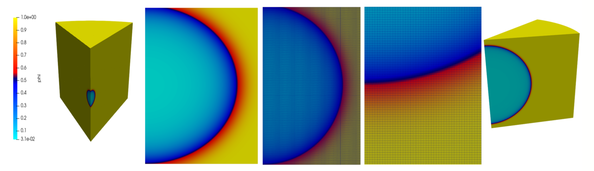
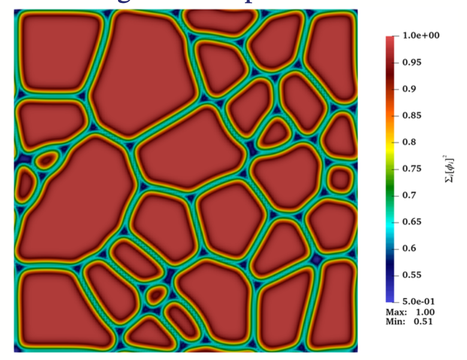
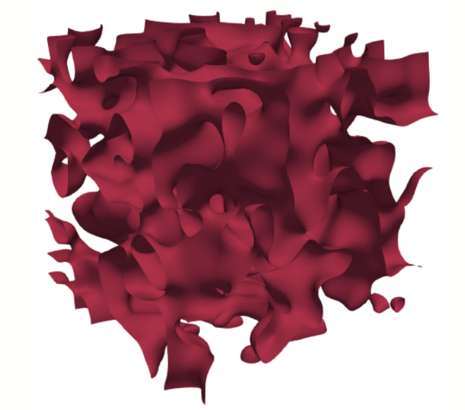

# About the SLOTH project

## Project summary

Phase-field methods represent a versatile and effective approach to modelling the spatiotemporal evolution of complex physical systems that exhibit significant heterogeneities, such as phase transitions, coalescence, and cracking. These methods have found extensive application in the field of materials science, including in the modelling of the behaviour of nuclear fuels. 

The phase-field approach has also been employed in recent studies conducted with the multiphysics computational tools of the PLEIADES platform[@pleiades]. Broadly speaking, the `PLEIADES`/Fuel Performance Codes[@alcyone,@germinal] aim at providing a state-of-the-art multiphysics multiscale description of the fuel under irradiated conditions. The inclusion of an advanced multiphysics and multiscale modelling such as phase-field, is a logical step forward.
Consequently, the CEA is developing **SLOTH**, a **multiphase-field multicomponent framework**, dedicated to the study of fuel behaviour at different scales of description, from nominal operating conditions to severe accident conditions. 

`PLEIADES/SLOTH` is developed at CEA under LPGL license (Version 3). It is based on the the `MFEM` Finite Element library[@mfem], which already includes the main features to have a robust, flexible and **massively parallel** implementation of the solution algorithms.

  

    
    
<em>[Incipient melting in a pellet fragment under an ad-hoc temperature dependent enthalpy of melting](https://github.com/Collab4Sloth/Gallery)</em>

  

  

    
    
<em>[Polycristalline microstructure with 30 grains](https://github.com/Collab4Sloth/Gallery)</em>

  

  

    
    
<em>[Spinodal decomposition](https://github.com/Collab4Sloth/Gallery)</em>

  

## Contributors

-   __Development Team__
  
    ---    
    - [Clément Introïni](https://www.researchgate.net/profile/Clement-Introini)
    - [Raphaël Prat](https://www.researchgate.net/profile/Raphael-Prat)

-   __Living Deep Neural Network__
  
    ---    
    - [Romain Le Tellier]()
    - [Tommaso Barani](https://www.researchgate.net/profile/Tommaso-Barani)
    - [Mathis Plapp](https://www.researchgate.net/profile/Mathis-Plapp)
    - [Isabelle Ramière](https://www.researchgate.net/profile/Isabelle-Ramiere)
    - [Luca Messina](https://scholar.google.com/citations?hl=fr&user=_q0x3tsAAAAJ&view_op=list_works&sortby=pubdate)
    - [Jérôme Sercombe](https://www.researchgate.net/profile/J-Sercombe)

-   __Students Team__

    ---
    - [Alessandro Scapini (PhD 2024-2027)]()
    - [Clément Plumecocq (PhD 2023-2026)]()
    - [Victor Navarre (Master 2025)]()
    - [Jules Czuckermand (Master 2025)]()     
    - [Mouad Bakhkakh (Master 2024)]()
    - [Etienne Delobre (Master 2023)]()
  

<!-- 
## License
The code is developed under [GNU LESSER GENERAL PUBLIC LICENSE Version 3](https://github.com/Collab4Sloth/SLOTH?tab=LGPL-3.0-1-ov-file) -->

<!-- ## Contact
If you have any questions, comments, suggestions or want to report a bug, please feel free to open an issue or discussion on [Github](https://github.com/Collab4Sloth/SLOTH).  -->
