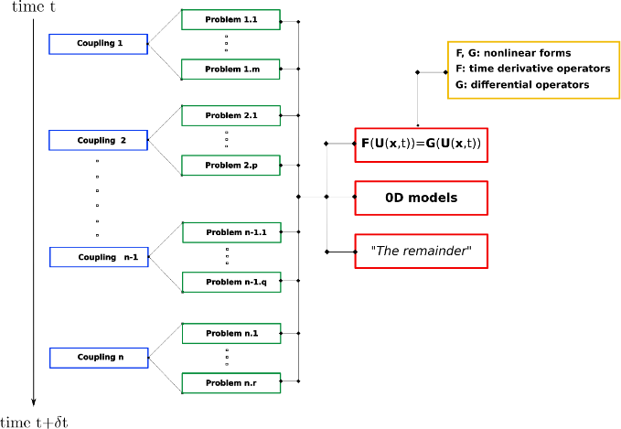

# Partial Differential Equations (*Coming soon*)

## Description

Partial Differential Equations (PDEs) are the most important kind of problems for `SLOTH`.

As illustrated in the figure 1, PDEs for `SLOTH` can be expressed in the following form:

```math
F(U(x,t))=G(U(x,t))
```

where $`U(x,t)`$ is the vector of unknowns expressed as a function of the time $`t`$ and the position $`x`$. In this equation, $`F`$ and $`G`$ are two nonlinear forms associated with the time derivative operator and the differential operators, respectively. For steady problem, $`F=0`$.

<figure markdown="span">
  {  width=600px}
  <figcaption>Figure 1 : Schematic description of one time-step for SLOTH simulations
</figcaption>
</figure>

All PDEs are solved using a unified nonlinear algorithm based on the Newton solver. This approach is adopted to maximize the generality of the implementation, although it may incur a minor computational overhead for linear PDEs.

!!! note "On the use of a Newton Solver"
    The use of a Newton solver represents a pragmatic choice. Nevertheless, the code has been structured in such a way that alternative algorithms can be incorporated in the future.

## Declaration & Use

Definition of PDEs for `SLOTH` is made with a C++ object of type `Problem`. 

`Problem` is a template class instantiated with three template parameters: first, an `OPERATOR` object, second, the `Variables` object (see `VARS`in the example), and third, the `Postprocessing` object (see `PST` in the example).

!!! example "Alias declaration for `Problem` class template"
    ```c++
    using PDE = Problem<OPERATOR, VARS, PST>;
    ```

The users are referred to dedicated pages of the user manual for details about [Variables](../../../Variables/index.md) and [PostProcessing](../../../PostProcessing/index.md).

The `OPERATOR` object in `Problem` corresponds to a C++ object that inherits from the template class `OperatorBase`. This class defines the specific PDEs to be solved.

The following operators can be used:
- PhaseFieldOperator
- HeatOperator
- DiffusionOperator

It is through the definition of the operators that one concretely enters the framework of MFEM. 