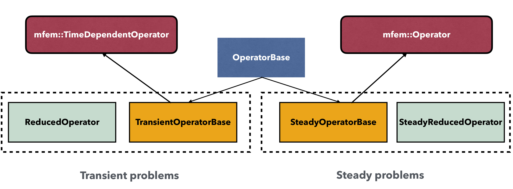
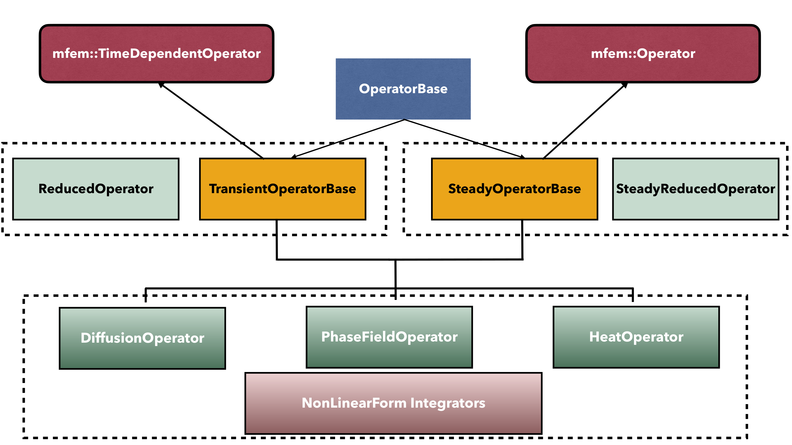

# Partial Differential Equations

Partial Differential Equations (PDEs) are the most important kind of problem for `SLOTH`.

As illustrated in the figure 1, PDEs for `SLOTH` can be expressed in the following form:

```math

\begin{align}
F(U(x,t))&=G(U(x,t))
\end{align}

```

where $`U(x,t)`$ is the vector of unknowns expressed as a function of the time $`t`$ and the position $`x`$. In this equation, $`F`$ and $`G`$ are two nonlinear forms associated with the time derivative operator and the differential operators, respectively. For steady problem, $`F=0`$.

<figure markdown="span">
  {  width=800px}
  <figcaption>Figure 1 : Schematic description of one time-step for `SLOTH` simulations with a focus on PDEs.
</figcaption>
</figure>

For `SLOTH`, all PDEs are solved using a unified nonlinear algorithm based on the Newton solver. This approach is adopted to maximize the generality of the implementation, although it may incur a minor computational overhead for linear PDEs.

!!! note "On the use of a Newton Solver"
    The use of a Newton solver represents a pragmatic choice. Nevertheless, the code has been structured in such a way that alternative algorithms can be incorporated in the future.


Definition of PDEs for `SLOTH` is made with a C++ object of type `Problem`, which is a template class instantiated with three template parameters: first, an `OPERATOR` object, second, a [Variables](../../../Variables/index.md) object (see `VARS` in the example), and third, a [PostProcessing](../../../PostProcessing/index.md) object (see `PST` in the example).

!!! example "Alias declaration for `Problem` class template"
    ```c++
    using PDE = Problem<OPERATOR, VARS, PST>;
    ```


The `OPERATOR` object in `Problem` refers to an object that inherits from base classes responsible for solving the nonlinear system (1). 
These classes are illustrated in the figure 2: `OperatorBase` is a base class with two child classes -- `TransientOperatorBase`, which inherits from the `TimeDependentOperator` class of `MFEM`, and `SteadyOperatorBase`, which inherits from the `Operator` class of `MFEM`. 
In addition to these three classes, there are two classes used to compute the residual and the Jacobian associated with the Newton-Raphson algorithm -- see `ReducedOperator` and `SteadyReducedOperator` classes in the figure 2.

<figure markdown="span">
  {  width=800px}
  <figcaption>Figure 2 : Three main classes managing the resolution of the non linear system.
</figcaption>
</figure>

As illustrated in the figure 3, these operators are associated with `NonLinearFormIntegrators` which are used to compute the residual vector and the Jacobian matrix for the nonlinear problems.

<figure markdown="span">
  {  width=800px}
  <figcaption>Figure 3 : Specific `Integrators` implemented in `SLOTH`.
</figcaption>
</figure>

## Integrators

All `SLOTH` integrators inherit from the `MFEM` `BlockNonlinearFormIntegrator` class. 
In the figure 3, the integrators are gathered in two grouped:

- Time Derivative Integrators (see $`F`$ in the equation (1)): `TimeDerivative`, `SplitTimeDerivative`, `HeatTimeDerivative`. **They are only used for transient problems**. 
  
    === "TimeDerivative"
        This integrator concerns the following mathemical expression:
        
        ```math

        \begin{align}
        \frac{\partial \varphi}{\partial t}
        \end{align}

        ```
    === "SplitTimeDerivative"
        This integrator concerns the following vectorial expression:
        
        ```math

        \begin{pmatrix}
        0
        \\
        \displaystyle\frac{\partial \varphi}{\partial t}
        \end{pmatrix}

        ```
        This integrator must be associated with the `SplitAllenCahn` and `CahnHilliard` integrators.

    === "HeatTimeDerivative"
        This integrator concerns the following mathemical expression:
        
        ```math

        \begin{align}
        \rho C_p\frac{\partial T}{\partial t}
        \end{align}

        ```
        where $`\rho`$ and $`C_p`$ are two `SLOTH` coefficients of type `GlossaryType::Concentration` and `GlossaryType::HeatCapacity`, respectively. 
        By default, coefficients are set to one. 

- Differential Operators  (see $`G`$ in the equation (1)): `Fick`, `Fourier`, `MassFlux`, `AllenCahn`, `SplitAllenCahn`, `CahnHilliard`, `MeltingCalphad`, `MeltingConstant`, `MeltingTemperature`. **They can be combined as for example, `AllenCahn` and  `MeltingTemperature`**.
  
    === "Fick"
        This integrator concerns the following mathemical expression:
        
        ```math

        \begin{align}
        \nabla\cdot \left[D(\varphi)\nabla \varphi \right]
        \end{align}

        ```
        where $`D`$ is a **mandantory** `SLOTH` coefficient of type `GlossaryType::Diffusivity`.

    === "Fourier"
        This integrator concerns the following mathemical expression:
        
        ```math

        \begin{align}
        \nabla\cdot \left[k(T)\nabla T \right]
        \end{align}

        ```
        where $`k`$ is a **mandantory** `SLOTH` coefficient of type `GlossaryType::Conductivity`.

    === "MassFlux"
        ff
    === "AllenCahn"
        This integrator concerns the following mathemical expression:
        
        ```math

        \begin{align}
        M_i{\left(\nabla \cdot \left[\lambda_i \nabla \varphi_i\right] - \displaystyle\frac{\partial F_i}{\partial \varphi_i}\right)}_i
        \end{align}

        ```
        where $`M_i`$, $`\lambda_i`$, and $`F_i`$ are  **mandantory** `SLOTH` coefficients of type `GlossaryType::Mobility`, `GlossaryType::Capillary` and `GlossaryType::FreeEnergy`, respectively.
    === "SplitAllenCahn"
        This integrator concerns the following mathemical expression:
        
        ```math

        \Biggl(
        \begin{array}{c}
        \eta - \nabla \cdot \left(\lambda \nabla \varphi\right)
        + \dfrac{\partial F}{\partial \varphi} \\
         M \eta
        \end{array}
        \Biggr)

        ```
        where $`M`$, $`\lambda`$, and $`F`$ are  **mandantory** `SLOTH` coefficients of type `GlossaryType::Mobility`, `GlossaryType::Capillary` and `GlossaryType::FreeEnergy`, respectively. 

        This integrator must be associated with the `SplitTimeDerivative` integrator.
    === "CahnHilliard"
        This integrator concerns the following mathemical expression:
        
        ```math

        \Biggl(
        \begin{array}{c}
        \mu - \nabla \cdot \left(\lambda \nabla \varphi\right)
        + \dfrac{\partial F}{\partial \varphi} \\
        \nabla \cdot \left(M \nabla \mu\right)
        \end{array}
        \Biggr)

        ```
        where $`M`$, $`\lambda`$, and $`F`$ are  **mandantory** `SLOTH` coefficients of type `GlossaryType::Mobility`, `GlossaryType::Capillary` and `GlossaryType::FreeEnergy`, respectively. 

        This integrator must be associated with the `SplitTimeDerivative` integrator.

    === "MeltingConstant"
        This integrator concerns the following mathemical expression:
        
        ```math

        \begin{align}
        M \alpha p'(\varphi) 
        \end{align}

        ```
        where $`M`$, $`p`$ are **mandantory** `SLOTH` coefficients of type `GlossaryType::Mobility` and `GlossaryType::PhaseFieldPotential`, respectively. 

        $`\alpha`$ is the enthalpy of melting. It is constant and equal to the value of parameter named `melting_factor`.
        
        This integrator can be used to simulate melting phenomena based on an ad-hoc melting contribution.

        For these simulations, it must be associated with the `AllenCahn` integrator.

        
    === "MeltingTemperature"
        This integrator concerns the following mathemical expression:
        
        ```math

        \begin{align}
        M \alpha p'(\varphi) 
        \end{align}

        ```
        where $`M`$, $`p`$ are **mandantory** `SLOTH` coefficients of type `GlossaryType::Mobility` and `GlossaryType::PhaseFieldPotential`, respectively. 

        $`\alpha`$ is the enthalpy of melting defined by:

        ```math

        \begin{align}
        \alpha&=&H_m\, ?\, T\geq T_m : 0  
        \end{align}

        ```
        where $`H_m`$ is the enthalpy of melting, $`T`$ the temperature and $`T_m`$ the temperature of melting.

        This integrator can be used to simulate melting phenomena based on an ad-hoc melting contribution.

        For these simulations, it must be associated with the `AllenCahn` integrator.

        Two mandatory parameters are requested by this integrator. They are listed in the table 1.

          | Parameter Name    | Type          | Default Value | Description                      |
          | ----------------- | ------------- | ------------- | -------------------------------- |
          | `melting_temperature` | `double` |               | melting temperature |
          | `melting_enthalpy`    | `double` |               | melting enthalpy    |
          
          : Table 1 - parameters allowed with `MeltingTemperature`

          For simulations based on this integrator, temperature must be defined as an auxiliary variable of the phase-field problem.

    === "MeltingCalphad"
        This integrator concerns the following mathemical expression:
        
        ```math

        \begin{align}
        M \alpha  \left[ p'(\varphi) + \mathcal{S}\right]
        \end{align}

        ```
        where $`M`$, $`p`$ are **mandantory** `SLOTH` coefficients of type `GlossaryType::Mobility` and `GlossaryType::PhaseFieldPotential`, respectively. 
        
        $`\mathcal{S}`$ is an optional seed value mimicking a nucleus calculated by a CALPHAD problem. 

        $`\alpha`$ is the enthalpy of melting calculated by a CALPHAD problem.

        This integrator can be used for CALPHAD-informed phase-field simulation[@introini2021phase]. 
        For these simulations, it must be associated with the `AllenCahn` integrator.

        Two mandatory parameters are requested by this integrator. They are listed in the table 1.

          | Parameter Name    | Type          | Default Value | Description                      |
          | ----------------- | ------------- | ------------- | -------------------------------- |
          | `primary_phase`   | `std::string` |               | name of the phase before melting |
          | `secondary_phase` | `std::string` |               | name of the phase after melting  |
          
          : Table 1 - parameters requested by `MeltingCalphad`

          For simulations based on this integrator, CALPHAD outputs -driving forces and nucleus- must be defined as auxiliary variables of the phase-field problem.

!!! note "On the inheritance from `BlockNonlinearFormIntegrator` instead of `NonlinearFormIntegrator`"
    For `SLOTH` integrators, inheriting from `BlockNonlinearFormIntegrator` maximizes the generality of the implementation, as it allows solving both single-unknown problems and problems with several unknowns. 
 
## Operators

=== "TransientOperator"

    This operator allows solving transient problems.


    `TransientOperator` is a template class instantiated with two template parameters: first, the kind of finite element and second, the spatial dimension.

    !!! example "Alias declaration for `TransientOperator` class template"
        This example show how to define a convenient alias for the `TransientOperator` class template instantiated with `mfem::H1_FECollection` in dimension 3.  
        
        ```c++
        using OPERATOR = TransientOperator<mfem::H1_FECollection, 3>;
        ```
    
    The `OPERATOR` operator must be defined by:

    - a vector of spatial discretisation objects (see [Meshing](../../../SpatialDiscretization/Meshing/index.md)) [required], 
    - a vector of strings specifying the integrators used to model spatial differential operators [required],
    - a set of parameters (see [Parameters](../../../Parameters/index.md)) [optional],
    - a ODE solver for time stepping [required],
    - a string specifying the integrator used to model time derivative operator [required].
  
    !!! warning "On the size of the vector of spatial discretisation objects"
        In `SLOTH`, each operator is designed to solve a system of PDEs with a monolithic algorithm.
        **The size of the vector of spatial discretisation objects must be equal to the number of unknowns**.

    Regarding the time stepping, three ODE solvers have been integrated in `SLOTH` among those provided by `MFEM`:

    -  The backward Euler method  (`SLOTH` object `TimeScheme::EulerImplicit`),
    -  The forward Euler method  (`SLOTH` object `TimeScheme::EulerExplicit`),
    -  The Runge-Kutta 4 method (`SLOTH` object `TimeScheme::RungeKutta4`).
  
    !!! note "Extension of the list of ODE solver in `SLOTH`"
        `MFEM` provides several ODE solvers. To begin, `SLOTH`development team integrates the most common methods, namely Euler and Runge-Kutta 4 methods. 

        In the future, this list could be extended to account for high order methods.

    !!! example "Definition of a transient operator"
        This example assume a Cahn-Hilliard problem with two unknowns (`phi` and `mu`). 
        The `OPERATOR` object, denoted by `phasefield_ope`, is well declared with a vector of two [spatial discretization](../../../SpatialDiscretization/index.md) objects, the `CahnHilliard` and `SplitTimeDerivative` integrators and an Euler Implicit time-stepping method.

        ```c++                                
        using OPERATOR = TransientOperator<mfem::H1_FECollection, 3>; 
        std::vector<SPA*> spatials{&spatial, &spatial};
        OPERATOR phasefield_ope(spatials, {"CahnHilliard"}, TimeScheme::EulerImplicit, "SplitTimeDerivative");
        ```
    

=== "SteadyOperator"

    This operator allows solving steady problems.

    `SteadyOperator` is a template class instantiated with two template parameters: first, the kind of finite element and second, the spatial dimension.

    !!! example "Alias declaration for `SteadyOperator` class template"
        This example show how to define a convenient alias for the `SteadyOperator` class template instantiated with `mfem::H1_FECollection` in dimension 3.  
        
        ```c++
        using OPERATOR = SteadyOperator<mfem::H1_FECollection, 3>;
        ```
    
    The `OPERATOR` operator must be defined by:

    - a vector of spatial discretisation objects (see [Meshing](../../../SpatialDiscretization/Meshing/index.md)) [required], 
    - a vector of strings specifying the integrators used to model spatial differential operators [required],
    - a set of parameters (see [Parameters](../../../Parameters/index.md)) [optional].
      
    !!! warning "On the size of the vector of spatial discretisation objects"
        In `SLOTH`, each operator is designed to solve a system of PDEs with a monolithic algorithm.
        **The size of the vector of spatial discretisation objects must be equal to the number of unknowns**.
  

    !!! example "Definition of a steady operator"
        This example assume an Allen-Cahn problem with one unknowns (`phi`). 
        The `OPERATOR` object, denoted by `phasefield_ope`, is well declared with a vector of one [spatial discretization](../../../SpatialDiscretization/index.md) object and the `AllenCahn`  integrator.

        ```c++                                
        using OPERATOR = SteadyOperator<mfem::H1_FECollection, 3>; 
        std::vector<SPA*> spatials{&spatial, &spatial};
        OPERATOR phasefield_ope(spatials, {"AllenCahn"});
        ```
    

## Problems


  The `SLOTH` integrators depend on the problem. Here, those currently used in `SLOTH` are described. 

  === "Cahn-Hilliard problems"

      The Cahn-Hilliard problems solved in `SLOTH` can be expressed in the following form:

      ```math

      \begin{align}
      \frac{\partial \phi}{\partial t}&= \nabla \cdot \left[M(\phi) \nabla \mu\right] \text{ in }\Omega 
      \\[6pt]    
      \mu &= \omega F'(\phi) - \nabla \cdot \left[\lambda \nabla \phi\right] \text{ in }\Omega 
      \end{align}

      ```

      where $`\phi`$ is the phase indicator, $`\mu`$ the generalized chemical potential and $`F'`$ the derivative against $`\phi`$ of a potential $`F`$.

      The integrators are:

      - `SplitTimeDerivative` for time derivative operator,
      - `CahnHilliard` for differential opertors.

      
      !!! tip "Declaration of the potential and mobility coefficient"
          The declaration of the three last template parameters will be simplified in a future version of `SLOTH`. 
          Waiting this evolution, `SLOTH` development team recommends:

          - `ThermodynamicsPotentialDiscretization::Implicit` for the temporal scheme for the potential $`F`$
          - `ThermodynamicsPotentials::F` for 
              
            ```math

            \begin{align*} 
            F(\phi)&=\frac{\phi^4}{4} - \frac{\phi^2}{2}
            \end{align*}

            ```

          -  `ThermodynamicsPotentials::W` for 
              
            ```math

            \begin{align*} 
            F(\phi)&=\phi^2 (1- \phi)^2
            \end{align*}

            ```

          -  `ThermodynamicsPotentials::WW` for 
              
            ```math

            \begin{align*} 
            F(\phi)&=(\phi-0.3)^2 (0.7 - \phi)^2
            \end{align*}

            ```

          - `Mobility::Constant` for a constant mobility $`M(\phi)=M`$
          - `Mobility::Degenerated` for a degenerated mobility defined by:
              
            ```math

            \begin{align*} 
            M(\phi)&=M \phi^n (1-\phi)^n, \quad n\geq0
            \end{align*}

            ```
      
      The only parameter available for `CahnHilliardNLFormIntegrator` is given in the table 2.
      
      | Parameter Name               | Type   | Default Value | Description                                                                                                                                                  |
      | ---------------------------- | ------ | ------------- | ------------------------------------------------------------------------------------------------------------------------------------------------------------ |
      | `ScaleMobilityByTemperature` | `bool` | `false`       | flag to indicate if the mobility coefficient is divided by the temperature. In this case, temperature must be defined as auxiliary variables of the problem. |
      
      : Table 2 - parameters allowed with `CahnHilliardNLFormIntegrator`


      !!! example "Definition of a Cahn-Hilliard problem"
          This example shows how to define a Cahn-Hilliard problem with two unknowns (`phi` and `mu`).

          ```c++
          
          using PST = PostProcessing<mfem::H1_FECollection, mfem::ParaviewDataCollection, 2>;
          using VARS = Variables<mfem::H1_FECollection, 3>
          using LHS_NLFI = TimeCHNLFormIntegrator<VARS>;
          using NLFI = CahnHilliardNLFormIntegrator<VARS, 
                                                    ThermodynamicsPotentialDiscretization::Implicit,
                                                    ThermodynamicsPotentials::F, 
                                                    Mobility::Constant>;
                                          
          using OPERATOR = PhaseFieldOperator<mfem::H1_FECollection, 3, NLFI, LHS_NLFI>;          
          using PB = Problem<OPERATOR,VARS,PST>;

          const double mob(1.e-1);
          const double lambda(1.e-4);
          const double omega(1.);
          auto phasefield_params = Parameters(Parameter("lambda", lambda), Parameter("omega", omega));         
          auto phasefield_vars = Variables(phi, mu); 
          auto phasefield_pst = PST(&spatial, pst_parameters);

          std::vector<SPA*> spatials{&spatial, &spatial};
          OPERATOR phasefield_ope(spatials, params, TimeScheme::EulerImplicit);
          phasefield_ope.overload_mobility(Parameters(Parameter("mob", mob)));

          PB phasefield_pb(phasefield_ope, phasefield_vars, phasefield_pst);

          ```
          !!! warning "On the value of the mobility coefficient"
              In addition to the example dedicted to the definition of the `PhaseFieldOperator`, it is important to note that the mobility coefficient is overloaded because by default, the mobility is set to $`1`$. 


      !!! tip "Declaration of the interpolation function"
          The declaration of the interpolation function will be simplified in a future version of `SLOTH`. 
          Waiting this evolution, `SLOTH` development team recommends:

          - `ThermodynamicsPotentials::H` for 
              
            ```math

            \begin{align*} 
            P(\phi)&=\phi^3  (6 \phi^2 - 15 \phi + 10)
            \end{align*}

            ```

          - `ThermodynamicsPotentials::X` for 
              
            ```math

            \begin{align*} 
            P(\phi)&=\phi
            \end{align*}

            ```
