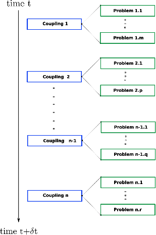

# Time discretization

This page describes the C++ object `TimeDiscretization`, which enables `SLOTH` to manage the time loop of all multiphysics simulations.

<figure markdown="span">
  {  width=300px}
  <figcaption>Figure 1 : Schematic description of one time-step for SLOTH simulations
</figcaption>
</figure>

`TimeDiscretization` object is simply defined by:

- a list of parameters
- a list of [`Coupling`](../MultiPhysicsCouplingScheme/Couplings/index.md)


The parameters allowed with `TimeDiscretization` are summarized in table 1.

| Object | Parameter Name | Type | Default Value | Description |
|------|----------------|------|---------------|---------------|
| `TimeDiscretization` | `"initial_time"` | `double` | `0.` | The initial time of the simulation |
| `TimeDiscretization` | `"final_time"` | `double` | | The final time of the simulation|
| `TimeDiscretization` | `"time_step"` | `double` | |The time-step of the simulation |

: Table 1 - parameters allowed with `TimeDiscretization`


!!! warning "On the time-step"
    - The time-step is currently constant. Adaptative time-stepping will be implemented in the future. 


!!! example "Example of `TimeDiscretization` with parameters"
    The following example assume a multiphysics simulation based on two couplings, each composed of three problems. 
    
    The time loop starts at $`0`$ s, ends at $`1`$ s with a time-step of $`0.1`$ s.

    ```c++
        auto coupling_example_1 = Coupling("MyCoupling1", Problem1_1, Problem1_2, Problem1_3);
        auto coupling_example_2 = Coupling("MyCoupling2", Problem2_1, Problem2_2, Problem2_3);

        const double t_initial = 0.0;
        const double t_final = 1.0;
        const double dt = 0.1;
        auto time_params = Parameters(
            Parameter("initial_time", t_initial),
            Parameter("final_time", t_final), 
            Parameter("time_step", dt));
        auto time = TimeDiscretization(time_parameters, coupling_example_1, coupling_example_2);
    ```