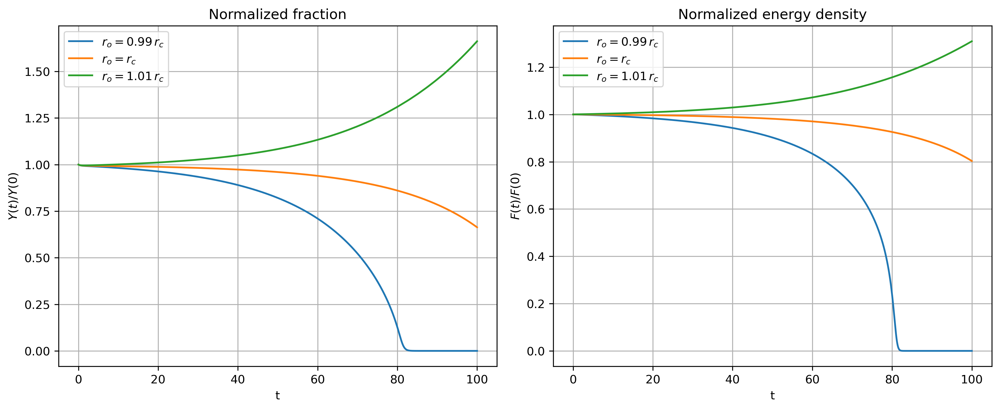

# **Example 2: homogeneous nucleation**

### __Files__ 

- Comprehensive test file: [main.cpp](https://github.com/Collab4Sloth/SLOTH/tree/master/tests/Studies/nucleation/test1/main.cpp)
- Reference results for comparison (r=0.99, t=0.1): [time_specialized.csv](https://github.com/Collab4Sloth/SLOTH/tree/master/tests/Studies/nucleation/test1/ref/ref099/time_specialized.csv)
- Reference results for comparison (r=1, t=0.1): [time_specialized.csv](https://github.com/Collab4Sloth/SLOTH/tree/master/tests/Studies/nucleation/test1/ref/ref1/time_specialized.csv)
- Reference results for comparison (r=1.01, t=0.1): [time_specialized.csv](https://github.com/Collab4Sloth/SLOTH/tree/master/tests/Studies/nucleation/test1/ref/ref101/time_specialized.csv)
- Reference results for comparison (r=0.99, t=100): [time_specialized.csv](https://github.com/Collab4Sloth/SLOTH/tree/master/tests/Studies/nucleation/test1/resu_256/Saves_099/time_specialized.csv)
- Reference results for comparison (r=1, t=100): [time_specialized.csv](https://github.com/Collab4Sloth/SLOTH/tree/master/tests/Studies/nucleation/test1/resu_256/Saves_1/time_specialized.csv)
- Reference results for comparison (r=1.01, t=100): [time_specialized.csv](https://github.com/Collab4Sloth/SLOTH/tree/master/tests/Studies/nucleation/test1/resu_256/Saves_101/time_specialized.csv)


### __Statement of the problem__ 

This test corresponds to the homogeneous nucleation test proposed on [PFhub](https://pages.nist.gov/pfhub/benchmarks/benchmark8.ipynb/), for single circular seed.


The domain $`\Omega`$ is a square $`[0,100]\times[0,100]`$

```math

\begin{align}
\frac{\partial \phi}{\partial t}&=-M (F'(\phi) - \lambda \Delta \phi - \Delta f p'(\phi)) \text{ in }\Omega 
\end{align}

```

where $`\phi`$ is the phase indicator, $`F'`$ the derivative against $`\phi`$ of the potential $`F`$ defined by:

```math

\begin{align} 
F(\phi)&=\omega\phi^2(1-\phi)^2
\end{align}

```

$`\Delta f`$ is the nucleation driving force defined as a function of the critical radius $`r^\star`$:

```math

\begin{align} 
\Delta f&=\dfrac{\sqrt{2}}{6 r^\star}
\end{align}

```

### __Initial condition__

The initial condition is given by:

```math

    \phi =  \dfrac{1}{2} - \dfrac{1}{2} \tanh\left(\dfrac{r-r_0}{\sqrt{2}}\right).

```


### **Parameters used for the test**
    
For this test, all phase-field parameters are equal to one. 

   | Description                        | Symbol      | Value                                         |
   | ---------------------------------- | ----------- | --------------------------------------------- |
   | mobility coefficient               | $`M_\phi`$  | $`1.0`$                                       |
   | energy gradient coefficient        | $`\lambda`$ | $`1`$                                         |
   | depth of the double-well potential | $`\omega`$  | $`1`$                                         |
   | radius of the initial circular seed     | $`r_0`$     | [$`0.99r^\star`$,$`r^\star`$,$`1.01r^\star`$] |
   | critical radius                    | $`r^\star`$ | $`5`$                                         |

### __Boundary conditions__

Periodic boundary conditions are prescribed on boundary of the domain.

### __Numerical scheme__

- Time integration: Euler Implicit over the interval $`t\in[0,100]`$ with a time-step $`\delta t=10^{-2}`$. 
- Spatial discretization for convergence analysis: uniform grid with $`N={256}`$ nodes in each spatial direction, with $`\mathcal{Q}_1`$ finite elements
- Newton solver: relative tolerance $`10^{-10}`$, absolute tolerance $`10^{-14}`$
- Iterative solver: HYPRE_GMRES 
- Preconditioner: HYPRE_ILU


### __Results__ 

Figures 1 shows the evolution of the normalized fraction and energy density. 
The results are in good agreement with those presented in [@WU2021110371] (see Figures 3 and 4 in the reference).

<figure markdown="span">
    {  width=700px}
    <figcaption>Figure 1: normalized fraction and energy density
    </figcaption>
</figure>

