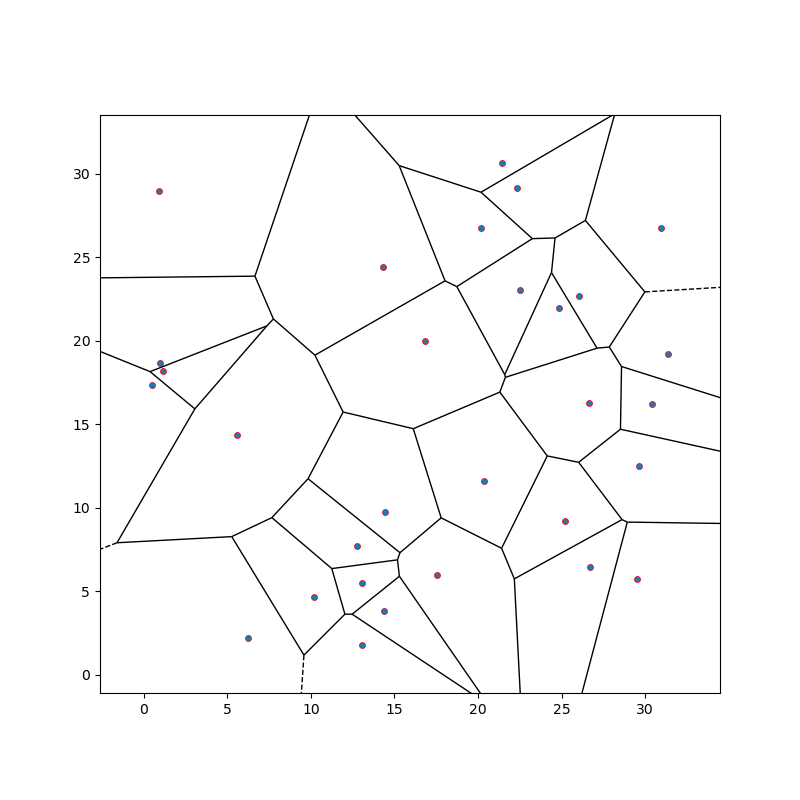
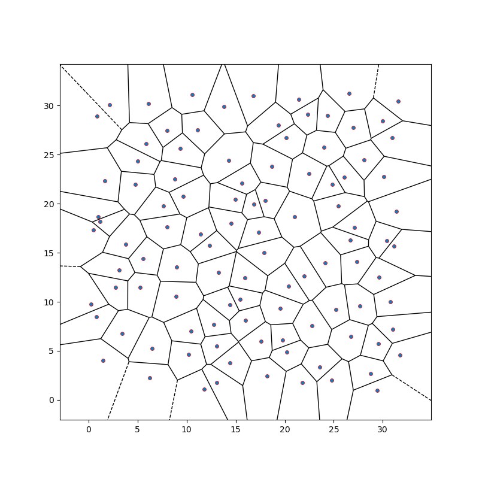

# **Example 3: time evolution of a polycristalline microstructures composed of 30 and 102 grains**

### __Files__ 

- 30 grains
    - Comprehensive test file (2D): [main.cpp](https://github.com/Collab4Sloth/SLOTH/tree/master/tests/Studies/multigrains/test1/main.cpp)
    - Comprehensive test file (3D): [main.cpp](https://github.com/Collab4Sloth/SLOTH/tree/master/tests/Studies/multigrains/test2/main.cpp)
    - 2D Reference results for comparison (regression test) (N=32, t=0.2): [time_specialized.csv](https://github.com/Collab4Sloth/SLOTH/tree/master/tests/Studies/multigrains/test1/ref/time_specialized.csv)
    - 2D Reference results for comparison (N=128, t=25): [time_specialized.csv](https://github.com/Collab4Sloth/SLOTH/tree/master/tests/Studies/multigrains/test1/resu/time_specialized.csv)
    - 3D Reference results for comparison (N=128, t=25): [time_specialized.csv](https://github.com/Collab4Sloth/SLOTH/tree/master/tests/Studies/multigrains/test2/resu/time_specialized.csv)
- 102 grains
    - Comprehensive test file (2D): [main.cpp](https://github.com/Collab4Sloth/SLOTH/tree/master/tests/Studies/multigrains/test1/main.cpp)
    - 2D Reference results for comparison (regression test) (N=32, t=0.2): [time_specialized.csv](https://github.com/Collab4Sloth/SLOTH/tree/master/tests/Studies/multigrains/test3/ref/time_specialized.csv)
    - 2D Reference results for comparison (N=128, t=25): [time_specialized.csv](https://github.com/Collab4Sloth/SLOTH/tree/master/tests/Studies/multigrains/test3/resu/time_specialized.csv)


### __Statement of the problem__ 

This test extends to 30 and 102 grains the one presented in [@biner2017programming] concerning the time evolution of a polycrystalline microstructure.

Allen-Cahn equations are solved in a square $`\Omega=[0,32]\times[0,32]`$ using an implicit monolithic algorithm.

```math

\begin{align}

\frac{\partial \eta_i}{\partial t} &= -L_i \frac{\delta F}{\delta \eta_i}, \qquad i = 1,\ldots,C

\end{align}

```

where the free energy density is defined by:

```math

\begin{align}

F &= \int_V \left[ \sum_{i=1}^{N} \left( -\frac{1}{2}\eta_i^2 + \frac{1}{4}\eta_i^4 \right)

+ \sum_{i=1}^{C} \sum_{\substack{j=1 \\ j \neq i}}^{C} (\eta_i^2 \eta_j^2)  + \sum_{i=1}^{C} \frac{\kappa_i}{2} \left|\nabla \eta_i \right|^2 \right] \, dv 


\end{align}

```

Hereabove, $`C`$ corresponds to the number of grains.

### __Initial condition__

The Voronoi-based 2D initialization is generated using the Voro++ library[@rycroft2009voro].

<figure markdown="span">
    { width=500px}
    <figcaption>Figure 1: initial polycrystalline microstructure composed of 30 grains.
    </figcaption>
</figure>

<figure markdown="span">
    { width=500px}
    <figcaption>Figure 2: initial polycrystalline microstructure composed of 102 grains.
    </figcaption>
</figure>


### **Parameters used for the test**

   | Description                        | Symbol      | Value                                         |
   | ---------------------------------- | ----------- | --------------------------------------------- |
   | mobility coefficients               | $`L_i`$  | $`5.0`$                                       |
   | energy gradient coefficients       | $`\kappa_i`$ | $`0.1`$                                         |

### __Boundary conditions__

Periodic boundary conditions are prescribed on boundary of the domain.

### __Numerical scheme__

- Time integration: Euler Implicit over the interval $`t\in[0,25]`$ with a time-step $`\delta t=10^{-1}`$. 
- Spatial discretization for convergence analysis: uniform grid with $`N={128}`$ nodes in each spatial direction, with $`\mathcal{Q}_1`$ finite elements
- LBFGS solver: relative tolerance $`10^{-10}`$, absolute tolerance $`10^{-14}`$


### __Results__ 

Figure 3 shows the time evolution of the normalized area and energy density for the polycrystalline microstructure composed of 30 grains. 
As shown on Figure 4, smaller grains tend to disappear, while larger grains grow. 
Figure 5 shows a 3D extension of the time evolution of the polycrystalline microstructure composed of 30 grains.

Figure 6 shows the time evolution of a polycrystalline microstructure composed of 102 grains.

<figure markdown="span">
    {  width=1000px}
    <figcaption>Figure 3: normalized area and energy density
    </figcaption>
</figure>

<figure markdown="span">
    { width=500px}
    <figcaption>Figure 4: time evolution of the polycrystalline microstructure composed of 30 grains.
    </figcaption>
</figure>

<figure markdown="span">
    { width=1000px}
    <figcaption>Figure 5: 3D extension of time evolution of the polycrystalline microstructure composed of 30 grains. (almost $`2.10`$ million DOF). The simulation has been performed with $`2048`$ MPI processes on Topaze supercomputer at CEA.
    </figcaption>
</figure>

<figure markdown="span">
    { width=500px}
    <figcaption>Figure 6: time evolution of the polycrystalline microstructure composed of 102 grains. 
    </figcaption>
</figure>

