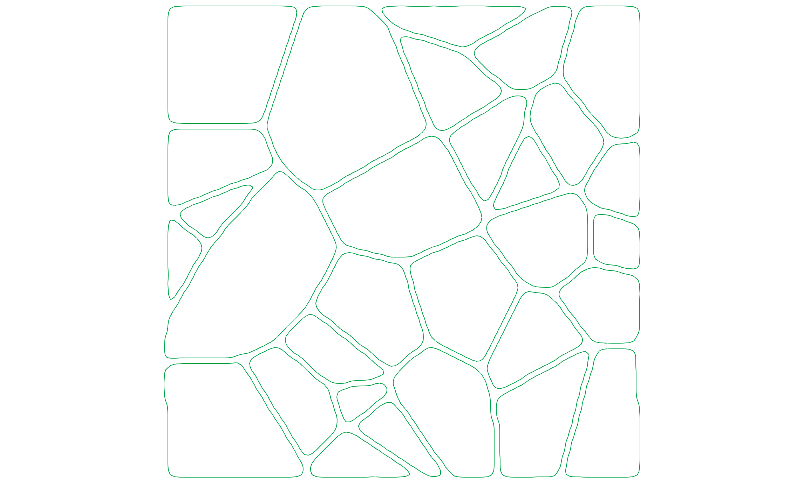
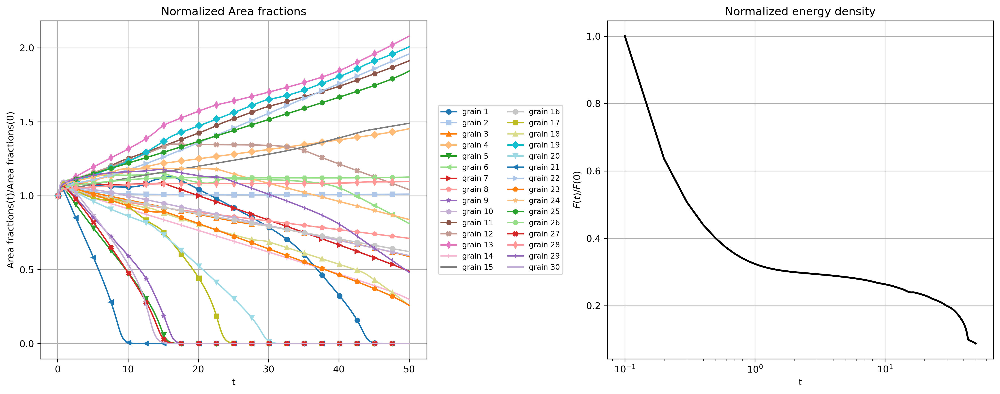

# **Example 3: time evolution of a polycristalline microstructure composed of 30 grains**

### __Files__ 

- Comprehensive test file: [main.cpp](https://github.com/Collab4Sloth/SLOTH/tree/master/tests/Studies/multigrains/test1/main.cpp)
- Reference results for comparison (regression test) (N=32, t=0.2): [time_specialized.csv](https://github.com/Collab4Sloth/SLOTH/tree/master/tests/Studies/multigrains/test1/ref/time_specialized.csv)
- Reference results for comparison (N=128, t=25): [time_specialized.csv](https://github.com/Collab4Sloth/SLOTH/tree/master/tests/Studies/multigrains/test1/resu/time_specialized.csv)


### __Statement of the problem__ 

This test extends to 30 grains the one presented in [@biner2017programming] concerning the time evolution of a polycrystalline microstructure.

Thirty Allen-Cahn equations are solved in a square $`\Omega=[0,32]\times[0,32]`$ using an implicit monolithic algorithm.

```math

\begin{align}

\frac{\partial \eta_i}{\partial t} &= -L_i \frac{\delta F}{\delta \eta_i}, \qquad i = 1,\ldots,30

\end{align}

```

where the free energy density is defined by:

```math

\begin{align}

F &= \int_V \left[ \sum_{i=1}^{N} \left( -\frac{1}{2}\eta_i^2 + \frac{1}{4}\eta_i^4 \right)

+ \sum_{i=1}^{30} \sum_{\substack{j=1 \\ j \neq i}}^{30} (\eta_i^2 \eta_j^2)  + \sum_{i=1}^{30} \frac{\kappa_i}{2} \left|\nabla \eta_i \right|^2 \right] \, dv 


\end{align}

```


### __Initial condition__

The Voronoi-based 2D initialization is generated using the Voro++ library[@rycroft2009voro].

<figure markdown="span">
    { width=500px}
    <figcaption>Figure 1: initial polycrystalline microstructure composed of 30 grains.
    </figcaption>
</figure>


### **Parameters used for the test**

   | Description                        | Symbol      | Value                                         |
   | ---------------------------------- | ----------- | --------------------------------------------- |
   | mobility coefficients               | $`L_i`$  | $`5.0`$                                       |
   | energy gradient coefficients       | $`\kappa_i`$ | $`0.1`$                                         |

### __Boundary conditions__

Periodic boundary conditions are prescribed on boundary of the domain.

### __Numerical scheme__

- Time integration: Euler Implicit over the interval $`t\in[0,25]`$ with a time-step $`\delta t=10^{-1}`$. 
- Spatial discretization for convergence analysis: uniform grid with $`N={128}`$ nodes in each spatial direction, with $`\mathcal{Q}_1`$ finite elements
- LBFGS solver: relative tolerance $`10^{-10}`$, absolute tolerance $`10^{-14}`$


### __Results__ 

Figure 2 shows the time evolution of the normalized area and energy density. 
Figure 3 shows the time evolution of the polycrystalline microstructure composed of 30 grains.
Smaller grains tend to disappear, while larger grains grow. 

<figure markdown="span">
    {  width=1000px}
    <figcaption>Figure 2: normalized area and energy density
    </figcaption>
</figure>

<figure markdown="span">
    { width=500px}
    <figcaption>Figure 3: time evolution of the polycrystalline microstructure composed of 30 grains.
    </figcaption>
</figure>

