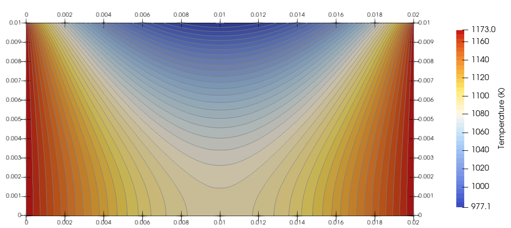

# **Example 3: solid with surface convection and radiation**

### __Files__ 

- Comprehensive test file: [main.cpp](https://github.com/Collab4Sloth/SLOTH/tree/master/tests/HeatTransfer/2D/test2/main.cpp)
- JSON file to define the Robin coefficient: [coefficient.json](https://github.com/Collab4Sloth/SLOTH/tree/master/tests/HeatTransfer/2D/test2/coefficient.json)
- Python file for verification: [verify.py](https://github.com/Collab4Sloth/SLOTH/tree/master/tests/HeatTransfer/2D/test2/verify.py)

### __Statement of the problem__ 

This test corresponds to a 2D steady simulation of the temperature in a solid with surface convection and radiation. 

The domain $`\Omega`$ is a rectangle $`0.02\times0.01`$

```math

\begin{align} 
0=[\nabla \cdot{} k\nabla T]\text{ in }\Omega 
\end{align}

```

### __Boundary conditions__

Robin boundary conditions are prescribed on $`\Gamma_{up}`$, Dirichlet boundary conditions are prescribed on $`\Gamma_{left}`$ and $`\Gamma_{right}`$ and Homogeneous Neumann boundary conditions are prescribed on $`\Gamma_{low}`$:

```math

\begin{align} 
{\bf{n}} \cdot{} k \nabla T + h T + \epsilon \sigma T^4 &=  hT_{\infty} + \epsilon \sigma T_{\infty}^4 \text{ on }\Gamma_{up}

\\[6pt]

T(x,y) &= T_d \text{ on } \Gamma_{left} \text{ and } \Gamma_{right}

\\[6pt]

{\bf{n}} \cdot{} k \nabla T  &=  0 \text{ on }\Gamma_{low}

\end{align}

```

### **Parameters used for the test**
    
For this test, the following parameters are considered:

| Parameter                          | Symbol          | Value                         |
| ---------------------------------- | --------------- | ----------------------------- |
| Thermal conductivity               | $`k`$           | $`3`$                         |
| Convection coefficient             | $`h`$           | $`50`$                        |
| Fluid temperature                  | $`T_{\infty}`$  | $`323`$                       |
| Dirichlet temperature              | $`T_d`$         | $`1173`$                      |


### __Numerical scheme__

- Spatial discretization: uniform grid with $`Nx=100`$ and $`Ny=50`$ nodes
- Newton solver: relative tolerance $`10^{-10}`$, absolute tolerance $`10^{-12}`$


### __Results__ 

Following [1] and [2], we expect, with a relative error of less than 0.01:

```math

\begin{align}
T(0.005,0.005) &= 1092.37 K
\\[6pt]
T(0.01,0.005) &= 1064.21 K
\\[6pt]
T(0.005,0) &= 1111.38 K
\end{align}

```

The agreement with the expected solution is verified with the script `verify.py`.

<figure markdown="span">
    {  width=800px}
    <figcaption>Figure 1 : Steady temperature field.
    </figcaption>
</figure>

## References

[1] J. P. Holman, Heat Transfer Tenth Edition. McGraw-Hill, pp. 111, Example 3-10 (2008).
$`\\[6pt]`$
[2] https://reference.wolfram.com/language/PDEModels/tutorial/HeatTransfer/HeatTransferVerificationTests.html, HeatTransfer-FEM-Stationary-2D-Single-HeatTransfer-0002
