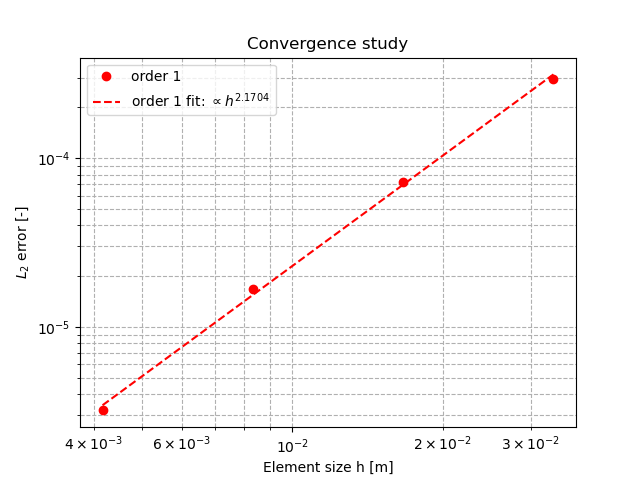

# **2D Axisymmetric Heat Transfer Problem with uniform Neumann BCs**

## __Files__ 

- Comprehensive test file: [main.cpp](https://github.com/Collab4Sloth/SLOTH/tree/master/tests/HeatTransfer/2D/test4/main.cpp)
- Reference results for comparison: [convergence_output_ref.csv](https://github.com/Collab4Sloth/SLOTH/tree/master/tests/HeatTransfer/2D/test4/ref/convergence_output_ref.csv)

## __Statement of the Problem__ 

This test corresponds to a 2D axisymmetric simulation of heat transfer in a solid. The domain $`\Omega`$ is an axisymmetric domain $`[0,1]\times[0,1]`$. The axis of symmetry is located at $`r=0`$.

```math
\begin{align} 
\rho C_p\frac{\partial T}{\partial t}&=\nabla \cdot k \nabla T  + S(r,z,t)\text{ in }\Omega 
\end{align}
```

In equation (1), $`S(r,z,t)`$ is the source term allowing the exact solution:

```math

\begin{align}
T(r,z,t) &=  e^{-t} cos (\pi r^2) cos(\pi z) - z
\end{align}

```

A convergence analysis is carried out to ensure the consistency of the results.

### __Initial condition__

The initial condition is given by:

```math

\begin{align}
T(r,z) &=  cos (\pi r^2) \cos(\pi z) - z
\end{align}

```

## __Boundary Conditions__

- Uniform Neumann boundary conditions are prescribed on the upper and lower surfaces.

```math
\begin{align}
{\bf{n}} \cdot{} k \nabla T  &=  1 \text{ on }\Gamma_{bottom} 
\\[6pt]

{\bf{n}} \cdot{} k \nabla T  &=  -1 \text{ on }\Gamma_{top}
\end{align}
```

- Homogeneous Neumann boundary conditions are prescribed on the left and right boundaries.

```math
\begin{align}

{\bf{n}} \cdot{} k \nabla T  &=  0 \text{ on } \Gamma_{left} \text{ and } \Gamma_{right}

\end{align}
```


## **Parameters Used for the Test**
    
For this test, all physical parameters are equal to one.

## __Numerical Scheme__

- Time integration: Euler Implicit over the interval $`t\in[0,0.01]`$ with a time-step $`\delta t=10^{-3}`$. 
- Spatial discretization for convergence analysis: uniform grid with $`N={30, 60, 90, 120}`$ nodes in each spatial direction, with $`\mathcal{Q}_1`$ 

## __Results__ 

Figures 1 shows the results of convergence analysis with $`\mathcal{Q}_1`$.

<figure markdown="span">
    {  width=500px}
    <figcaption>Figure 1: convergence analysis with $`\mathcal{Q}_1`$ finite elements
    </figcaption>
</figure>