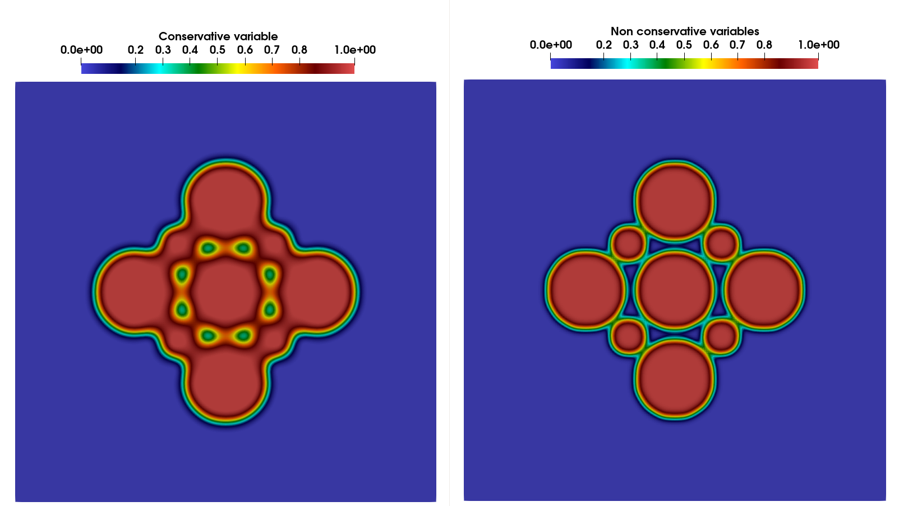
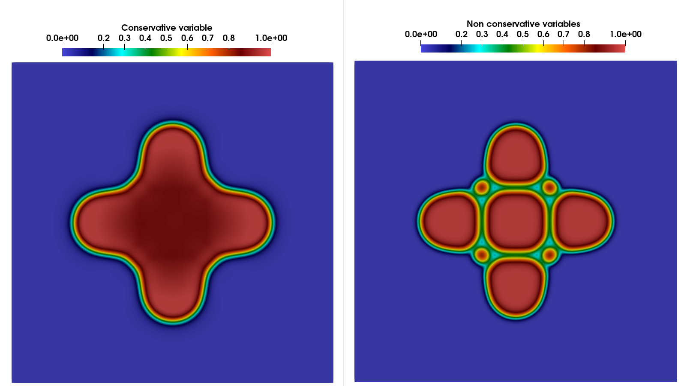
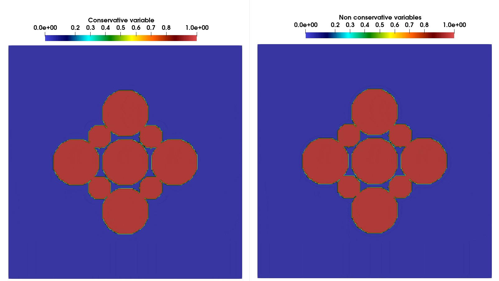

# **Example 1: sintering of two unequal sized particles**

### __Files__ 

- Comprehensive test file: [main.cpp](https://github.com/Collab4Sloth/SLOTH/tree/master/tests/Studies/sintering/test2/main.cpp)
- Reference results for comparison (regression test) (t=0.0002): [time_specialized.csv](https://github.com/Collab4Sloth/SLOTH/tree/master/tests/Studies/sintering/test2/ref/time_specialized.csv)
- Reference results for comparison (t=0.25): [time_specialized.csv](https://github.com/Collab4Sloth/SLOTH/tree/master/tests/Studies/sintering/test2/resu/time_specialized.csv)


### __Statement of the problem__ 

This test is a Finite Element version of the sintering test of nine unequal sized particles from [@biner2017programming].

Allen-Cahn (AC) and Cahn-Hilliard (CH) equations are solved in a square $`\Omega=[0,50]\times[0,50]`$ using a partitioned algorithm (but the Allen-Cahn equations are tightly coupled).


```math

\begin{align}

(CH)\quad \frac{\partial \rho}{\partial t}
&=
\nabla \cdot
D \nabla
\left(
\frac{\partial f}{\partial \rho}
-
\kappa_{\rho}\nabla^{2}\rho
\right)


\\[5pt]


(AC)\quad \frac{\partial \eta_i}{\partial t}
&=
-L\left(
\frac{\partial f}{\partial \eta_i}
-
\kappa_{\eta}\nabla^{2}\eta_i
\right), \quad i=1,9


\end{align}

```

The mobility coefficient $`D`$ in the Cahn-Hilliard equations is given by:


```math

\begin{align}

D
&=
D_{\mathrm{vol}}p(\rho)
+
D_{\mathrm{vap}}\left[1-p(\rho)\right]
+
D_{\mathrm{surf}}\rho(1-\rho)
+
D_{\mathrm{gb}}
\sum_i \sum_{i\neq m}\eta_i\eta_m

\\[5pt]

p(\rho)&=\rho^3(6\rho^2-15\rho +10)
\end{align}

```

The free energy density is defined by:

```math

\begin{align}

F
&=
\int_V
\left[
f(\rho,\eta_{1\ldots p})
+
\frac{\kappa_{\rho}}{2}(\nabla \rho)^2
+
\sum_i
\frac{\kappa_{\eta}}{2}
(\nabla \eta_i)^2
\right]
\, dv

\end{align}

```

where


```math

\begin{align}

f(\rho,\eta_{i\ldots p})
&=
16\rho^{2}(1-\rho)^{2}
+
\left[
\rho^{2}
+
6(1-\rho)\sum_i \eta_i^{2}
-
4(2-\rho)\sum_i \eta_i^{3}
+
3\left(\sum_i \eta_i^{2}\right)^{2}
\right]

\end{align}

```


### __Initial condition__

The initial condition for the Cahn-Hilliard equation is given by:


```math

\begin{align}

\rho(\mathbf{x}, 0) &= 
\begin{cases}
1, & \sqrt{(x - 14.5)^2 + (y - 25)^2} < 5, \\
1, & \sqrt{(x - 35.5)^2 + (y - 25)^2} < 5, \\ 
1, & \sqrt{(x - 25)^2 + (y - 14.5)^2} < 5  \\
1, & \sqrt{(x - 25)^2 + (y - 35.5)^2} < 5, \\ 
1, & \sqrt{(x - 25)^2 + (y - 25)^2} < 5,  \\
1, & \sqrt{(x - 19.5)^2 + (y - 19.5)^2} < 2.5, \\ 
1, & \sqrt{(x - 30.5)^2 + (y - 19.5)^2} < 2.5  \\
1, & \sqrt{(x - 19.5)^2 + (y - 30.5)^2} < 2.5, \\ 
1, & \sqrt{(x - 30.5)^2 + (y - 30.5)^2} < 2.5, \\
0, & \text{otherwise}.
\end{cases}
\end{align}

```


The initial conditions for the Allen-Cahn equations are given by:

```math

\begin{align}


\eta_1(\mathbf{x}, 0) &= 
\begin{cases}
1 &  \sqrt{(x - 14.5)^2 + (y - 25)^2} < 5, \\
0 & \text{otherwise}.
\end{cases}


\end{align}

```


```math

\begin{align}


\eta_2(\mathbf{x}, 0) &= 
\begin{cases}
1 &  \sqrt{(x - 35.5)^2 + (y - 25)^2} < 5, \\
0 & \text{otherwise}.
\end{cases}


\end{align}

```

```math

\begin{align}

\eta_3(\mathbf{x}, 0) &= 
\begin{cases}
1 &  \sqrt{(x - 25)^2 + (y - 14.5)^2} < 5, \\
0 & \text{otherwise}.
\end{cases}


\end{align}

```

```math

\begin{align}


\eta_4(\mathbf{x}, 0) &= 
\begin{cases}
1, &  \sqrt{(x - 25)^2 + (y - 35.5)^2} < 5, \\
0, & \text{otherwise}.
\end{cases}

\end{align}

```

```math

\begin{align}


\eta_5(\mathbf{x}, 0) &= 
\begin{cases}
1, &  \sqrt{(x - 25)^2 + (y - 25)^2} < 5, \\
0, & \text{otherwise}.
\end{cases}

\end{align}

```

```math

\begin{align}

\eta_6(\mathbf{x}, 0) &= 
\begin{cases}
1, &  \sqrt{(x - 19.5)^2 + (y - 19.5)^2} < 2.5, \\
0, & \text{otherwise}.
\end{cases}


\end{align}

```

```math

\begin{align}

\eta_7(\mathbf{x}, 0) &= 
\begin{cases}
1, &  \sqrt{(x - 30.5)^2 + (y - 19.5)^2} < 2.5, \\
0, & \text{otherwise}.
\end{cases}


\end{align}

```

```math

\begin{align}

\eta_8(\mathbf{x}, 0) &= 
\begin{cases}
1, &  \sqrt{(x - 19.5)^2 + (y - 30.5)^2} < 2.5, \\
0, & \text{otherwise}.
\end{cases}


\end{align}

```

```math

\begin{align}

\eta_9(\mathbf{x}, 0) &= 
\begin{cases}
1, &  \sqrt{(x - 30.5)^2 + (y - 30.5)^2} < 2.5, \\
0, & \text{otherwise}.
\end{cases}


\end{align}
```

### **Parameters used for the test**

   | Description                          | Symbol                | Value     |
   | ------------------------------------ | --------------------- | --------- |
   | mobility coefficient (AC)            | $`L`$                 | $`10.0`$  |
   | energy gradient coefficient (AC)     | $`\kappa_\eta`$       | $`5`$     |
   | energy gradient coefficient (CH)     | $`\kappa_\rho`$       | $`2`$     |
   | bulk diffusivity in the lattice (CH) | $`D_{\mathrm{vol}}`$  | $`0.04`$  |
   | diffusivity of the vapor phase (CH)  | $`D_{\mathrm{vap}}`$  | $`0.002`$ |
   | surface diffusivity (CH)             | $`D_{\mathrm{surf}}`$ | $`16`$    |
   | grain boundary diffusivity (CH)      | $`D_{\mathrm{gb}}`$   | $`1.6`$   |


### __Boundary conditions__

Neumann boundary conditions are prescribed on boundary of the domain.

### __Numerical scheme__

- Time integration: Euler Implicit over the interval $`t\in[0,0.25]`$ with a time-step $`\delta t=10^{-4}`$. 
- Spatial discretization for convergence analysis: uniform grid with $`N={200}`$ nodes in each spatial direction, with $`\mathcal{Q}_1`$ finite elements
- Newton solver: relative tolerance $`10^{-10}`$, absolute tolerance $`10^{-14}`$


### __Results__ 

Figure 1 shows the evolution of conserved and non conserved phase-fields at time step 100 and 2500 (from top to bottom). 
Figure 2 shows the time evolution of nine unequal sized particles. 
The results are in good agreement with those presented in [@biner2017programming] (see Figure 4.12 in the reference).

<figure markdown="span">
    {  width=500px}
    {  width=500px}
    <figcaption>Figure 1: evolution of conserved and non conserved phase-fields at time step 100 and 2500 (from top to bottom).
    </figcaption>
</figure>

<figure markdown="span">
    { width=500px}
    <figcaption>Figure 2: time evolution of nine unequal sized particles.
    </figcaption>
</figure>

