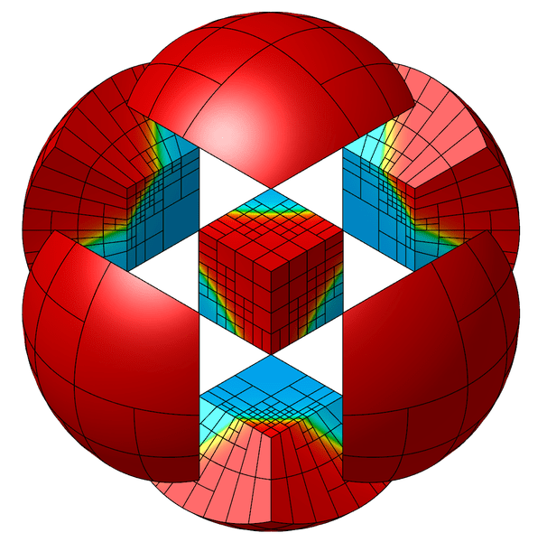

# **SLOTH**

  <b>
  The multiphase-field multicomponent framework of the PLEIADES platform
</b>
  <b>
  based on MFEM
</b>

  
  <!--  -->
  
  

-   __Features__

    ---

     - Phase-field modelling
     - Finite Element, AMR
     - Unsteady, nonlinear, coupled problems
     - Massively parallel MPI implementation 
     - Calphad-informed phase-field

-   __News__

    ---

     - SLOTH at [NuMat Conference](https://www.elsevier.com/events/conferences/all/the-nuclear-materials-conference) [10/24]

-   __Latest Release__

    ---

    (_Coming  soon_)

-   __Contact__

    ---

    Use the [Github issue tracker](https://github.com/Collab4Sloth/SLOTH/issues) to report bugs or comments. 
    
    See the [About](About/index.md) page for contact and license information.

